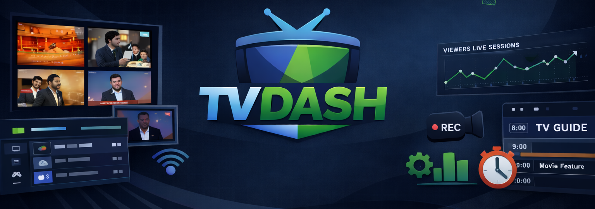
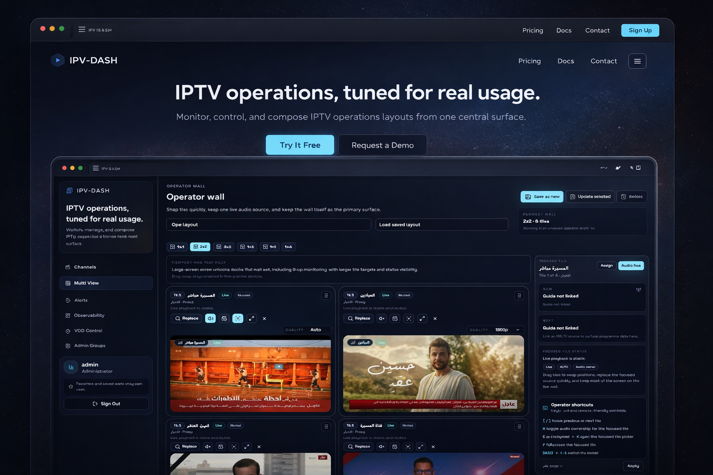

<a href="https://wweziz0001.github.io/TV-Dash" target="_blank" rel="noopener">
  <picture>
    <source media="(prefers-color-scheme: dark)" alt="TvDash" srcset="./docs/tvdash-banner.png" />
    
  </picture>
</a>

<h4 align="center">
  <a href="https://wweziz0001.github.io/TV-Dash">TV Dash</a> |
  <a href="https://wweziz0001.github.io/TV-Dash/blog">Blog</a> |
  <a href="https://wweziz0001.github.io/TV-Dash/docs">Documentation</a> |
</h4>

<div align="center">
  <h2>
    TvDash is a self-hosted IPTV and Web TV control surface. </br>
    HLS playback, Quality switching, and Multi-view. </br>
  <br />
  </h2>
</div>

<br />
<p align="center">
  <a href="https://github.com/wweziz0001/TV-Dash/blob/main/LICENSE">
    </a>
  <a href="https://www.npmjs.com/package/@tvdash/tvdash">
    </a>
  <a href="https://docs.tvdash.com/docs/introduction/contributing">
    </a>
  <a href="https://discord.gg/tvdash">
    </a>
  <a href="https://deepwiki.com/tvdash/tvdash">
    </a>
  <a href="https://twitter.com/tvdash">
    </a>
</p>

<div align="center">
  <figure>
    <a href="https://wweziz0001.github.io/TV-Dash" target="_blank" rel="noopener">
      
    </a>
    <figcaption>
      <p align="center">
        Watch live channels with flexible quality control and multi-view monitoring.
      </p>
    </figcaption>
  </figure>
</div>


## Current Features

TvDash currently supports:

- 📺 Live TV channel management.
- 🗂️ Channel groups and categories.
- ▶️ HLS live stream playback.
- ⚙️ Automatic and manual quality switching.
- 🧩 Single-channel viewing mode.
- 🖥️ Multi-view / split-screen watching.
- ⭐ Favorites support.
- 💾 Saved viewing layouts.
- 🧠 Master playlist channel support.
- 🔧 Manual quality-variant channel support.
- 🪄 Synthetic master playlist generation for manual variants.
- 📡 Stream monitoring and diagnostics.
- 👥 Live viewer/session monitoring.
- 👁️ See who is watching right now.
- 📊 Per-channel current viewer counts.
- 📝 Admin logs / observability tools.
- 📋 Admin monitoring dashboard summary.
- 🏗️ Structured project architecture and engineering standards.
- 🧪 Test coverage for critical flows.
- 📚 Handoff, documentation, and development governance.
- 📅 Full EPG / TV guide support.
- 📝 Manual program schedule entry per channel.
- 🌐 Import program schedules from external sources.
- ⏭️ Now / Next program display.
- ⏺️ Live channel recording.
- ⏰ Timed recording.
- 🗓️ Scheduled recording.
- 🎞️ Recorded media library.
- 📂 Recorded content browsing and playback.

## Planned Features

TvDash will support soon:

- 🎞️ shared channel restream / edge caching for local viewers.
- ▶️ Live Timeshift / DVR Buffer.
- 📺 Player Controls Pip and Cross browser media ux.
- 🔐 Security, access control, and admin hardening.
- 👤 Role-based permissions.
- 🧾 Audit trail for admin actions.
- 📱 Mobile and tablet optimized experience.
- 📺 TV / large-screen operator layouts.
- 🚀 Deployment and release readiness improvements.
- 📼 DVR / recording foundation expansion.
- ✨ Final enterprise polish and platform hardening.

## Stack

- Frontend: React, TypeScript, Vite, Tailwind CSS, React Query, HLS.js
- Backend: Node.js, Fastify, Prisma, Zod
- Database: PostgreSQL
- Shared contracts: workspace package with shared Zod schemas and types

## Implemented MVP

- Admin authentication with seeded `ADMIN` and `USER` accounts
- Channel groups and channel CRUD backed by PostgreSQL
- One master HLS URL per logical channel
- Real HLS.js playback with detected quality levels and preserved `Auto` mode
- Single-channel watch page
- Multi-view layouts: `1x1`, `2x2`, `3x3`, `1+2`, `1+4`
- Favorites and saved layout persistence
- Stream test endpoint plus admin preview player

## Workspace Layout

```text
docs/
  architecture/  Repository policy, structure, API, player, and testing docs
  decisions/     ADR-style decision records
  runbooks/      Local development and release procedures
  handoff/       Current-state context for future Codex sessions
apps/
  api/           Fastify API, Prisma schema, migrations, seed data
  web/           React/Vite operator UI and admin experience
packages/
  shared/        Shared Zod schemas and TypeScript contracts
scripts/         Local smoke test helper
tests/           Reserved for future cross-workspace regression suites
```

## Local Run
0. all 
  - `sudo apt install -y ffmpeg`
  - `cp .env.example .env`
  - `npm install`
  - `npm run db:generate`
  - `npm run db:migrate`
  - `npm run db:seed`
  - `npm run dev`
1. Copy the root env file:
   - `cp .env.example .env`
2. Ensure PostgreSQL is available at the `DATABASE_URL` in `.env`.
3. Apply the database schema and seed data:
   - `npm run db:generate`
   - `cd apps/api && dotenv -e ../../.env -- prisma migrate deploy`
   - `npm run db:seed`
4. Start the apps:
   - `npm run dev`
5. Verify locally:
   - `npm run lint`
   - `npm run test`
   - `npm run build`
6. Optional smoke test against a running API:
   - `npm run smoke:test`

## Seeded Accounts

- Admin: `admin@tvdash.local` / `Admin123!`
- Viewer: `viewer@tvdash.local` / `Viewer123!`

## Key URLs

- Web app: `http://localhost:5173`
- API: `http://localhost:4000/api`
- Health check: `http://localhost:4000/api/health`

## More Detail

- [docs/architecture/project-structure.md](docs/architecture/project-structure.md)
- [docs/architecture/development-policy.md](docs/architecture/development-policy.md)
- [docs/architecture/testing-strategy.md](docs/architecture/testing-strategy.md)
- [docs/architecture/player-architecture.md](docs/architecture/player-architecture.md)
- [docs/architecture/api-boundaries.md](docs/architecture/api-boundaries.md)
- [docs/handoff/codex-handoff.md](docs/handoff/codex-handoff.md)
- [docs/handoff/codex-session-log.md](docs/handoff/codex-session-log.md)
